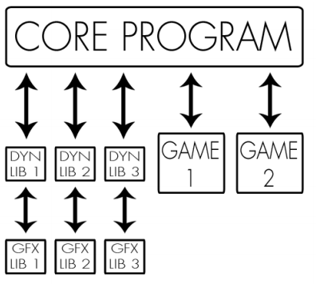

# [ICore](../core/ICore.hpp)



**/!\\ ALL ELEMENTS ARE SCOPPED IN THE `arcade` NAMESPACE /!\\**

In our implementation of `Core` part of the project, the `Core` (or rather the `ICore` ) acts as a "portal" between the games and the graphic libraries.

It is its role to load all available libraries (games and gfx) at the start of the program.

As it is a "portal", the game loop is meant to be in the games and the `ICore` has the same methods as the [ILibGraph](./ILibGraph.md) and more, but it does not inherit from it (because it is not a graphic library).

## Error cases

If the `Core` fails to load all available dynamic libraries contained in `./game` and `./lib` , it will throw a custom exception inheriting from `std::exception` , stopping the execution of the program.

## Keybindings

The `Core` has reserved keybinds to execute specific actions:

* **F1**: Previous graphical library
* **F2**: Next graphical library
* **F3**: Previous game
* **F4**: Next game
* **F5**: Reset game
* **F6**: Return to main menu
* **F7**: Quit arcade

These keybinds are by the `Core` and are prioritized over the games' ones.
If the `Exit` , `Next Game` or `Previous Game` key is pressed, the `Core` will ask for the game to stop (through the `IGame::stop()` method) before adding the next game execution to a queue of action (queue of lamdas).

## Game scores

Scores are automatically updated and saved at the program's end. A high score is saved per user per game.

## All the methods

Our `Core` class inherits from the `ICore` interface. And, as mentioned previously, the `Core` serves as a sort of API (a proxy if you will) between the games and graphical libraries for them to interact.
Here are all the methods of the `Core` (from the `ICore` ) that the game has access to:

### ICore::loadResource[...]

```c++
void loadResourceAudio(int id, std::string filepath);
void loadResourceFont(int id, std::string filepath);
void loadResourceImage(int id, std::string filepathGraph, std::string filepathAscii);
```

> These methods loads different types of resources for them to be referred by their `id`s' later. If an `id` is already taken the existing resource will be replaced. If a file cannot be loaded, an exception will be thrown, stopping the program.

### ICore::resetResource

```c++
void resetResource();
```

> Erases internal resource lists.

### ICore::createClock

```c++
std::unique_ptr<IClock> createClock();
```

> Creates an instance of `std::unique_ptr<IClock>`. See [IClock](./IClock.md)

### ICore::getKeyboardEvents

```c++
void getKeyboardEvents(std::vector<KeyState> &keys);
```

> Takes a vector of KeyState as parameter (see [KeyState](./KeyState.md)) which represents the keys you want to check the state of. The method will then set the state of every key in the vector depending on the latest keyboard inputs. **This method will also check it the Core's keybinds were pressed.**

### ICore::displayImage

```c++
void displayImage(int id, int posX, int posY);
void displayImage(int id, double posX, double posY);
```

> Calls the corresponding `displayImage` method of the current `ILibGraph`

### ICore::displayText

```c++
void displayText(int id, int posX, int posY, std::string const &text);
```

> Calls the `displayText` method of the current `ILibGraph`

### ICore::playAudio

```c++
void playAudio(int id, bool repeat = false);
```

> Calls the `playAudio` method of the current `ILibGraph`

### ICore::stopAudio

```c++
void stopAudio(int id);
```

> Calls the `stopAudio` method of the current `ILibGraph`

### ICore::clear

```c++
void clear();
```

> Calls the `clear` method of the current `ILibGraph`

### ICore::render

```c++
void render();
```

> Calls the `render` method of the current `ILibGraph`
